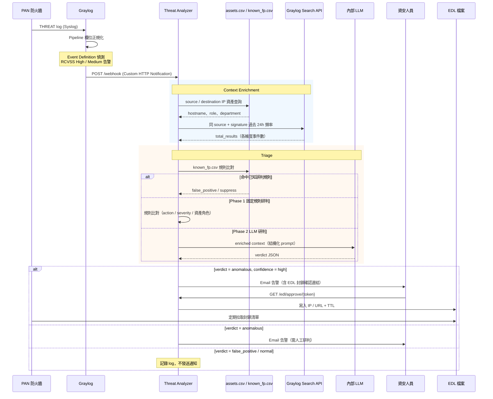

# Graylog Threat Analyzer

接收 Palo Alto Networks 防火牆 THREAT log（透過 Graylog HTTP Notification），進行 Context Enrichment 與 LLM 研判，自動將事件分類為異常 / 誤判 / 正常，並依風險等級採取對應行動。

---

## 功能特色

- **多層次研判**：known_fp.csv 快速過濾 → Phase 1 固定規則 → Phase 2 LLM 語意研判，逐層遞進
- **Context Enrichment**：資產清冊查詢（IP → 主機角色/部門）、Graylog 歷史頻率分析
- **EDL 封鎖建議**：高置信度異常事件自動產生封鎖建議，Email 含一鍵確認連結，寫入後 PAN 防火牆可直接拉取
- **已知誤判抑制**：`known_fp.csv` 資料驅動，新增規則無需改程式碼，支援 signature / action / IP 多維比對
- **HTML 告警 Email**：結構化呈現 verdict、enriched context、頻率統計，支援多位收件人

---

## 系統流程



---

## 研判流程

事件依下列優先順序逐層研判，命中第一層即回傳結果：

| 層級 | 機制 | 觸發條件 | 結果 |
|------|------|----------|------|
| 0 | **known_fp.csv** | 符合 signature + action + IP 比對規則 | `false_positive` / suppress |
| 1-1 | **固定規則：PA 已阻擋** | action = drop/block-ip/reset-both，來源為外部 IP | `false_positive` |
| 1-2 | **固定規則：informational alert** | severity = informational，action = alert | `normal` |
| 1-3 | **固定規則：已知端點 → AD** | src 為 user-endpoint，dst 為 domain-controller，NTLMSSP | `normal` |
| 1-4 | **固定規則：未知外部 IP** | src 不在資產清冊且非 RFC1918 | `anomalous` / high / block |
| 1-5 | **固定規則：未知內部 IP** | src 不在資產清冊但為 RFC1918 | `anomalous` / medium |
| 1-6 | **固定規則：多 Signature 掃描** | 同 src 過去 24h 觸發 > 5 種 signature | `anomalous` / medium |
| 2 | **LLM 研判** | 未命中以上規則，且已設定 LLM endpoint | LLM 回傳 verdict JSON |
| — | **預設** | 所有規則皆未命中 | `anomalous` / low / monitor |

---

## 目錄結構

```
graylog-threat-analyzer/
├── src/
│   ├── webhook_server.py   # FastAPI 主入口，接收 /webhook
│   ├── enrichment.py       # Context enrichment（資產、頻率）
│   ├── graylog_client.py   # Graylog Search API 封裝
│   ├── llm_client.py       # LLM 研判（Phase 1 規則 + Phase 2 LLM）
│   ├── known_fp.py         # known_fp.csv 快速過濾
│   ├── notifier.py         # HTML Email 通知
│   └── edl_manager.py      # EDL 管理（pending queue + TTL）
├── config/
│   ├── config.example.yaml # 設定範本
│   ├── assets.csv          # IP 資產清冊（IP → hostname/role/department）
│   └── known_fp.csv        # 已知誤判規則
├── prompts/
│   └── triage.md           # LLM prompt template
├── tests/
│   └── test_webhook.py     # pytest 測試（20 cases）
├── scripts/
│   └── preview_email.py    # Email 樣式預覽工具
├── Dockerfile
└── requirements.txt
```

---

## 快速開始

```bash
# 1. 安裝依賴
pip install -r requirements.txt

# 2. 複製並編輯設定
cp config/config.example.yaml config/config.yaml
# 填入 Graylog API、LLM endpoint、SMTP、EDL 路徑

# 3. 啟動服務
uvicorn src.webhook_server:app --host 0.0.0.0 --port 8000

# 或使用 Docker
docker build -t graylog-threat-analyzer .
docker run -p 8000:8000 -v $(pwd)/config:/app/config graylog-threat-analyzer

# 4. 確認服務正常
curl http://localhost:8000/health
```

---

## 設定說明

詳見 `config/config.example.yaml`，主要區塊：

| 區塊 | 重要欄位 | 說明 |
|------|----------|------|
| `server` | `webhook_token` | Graylog webhook 驗證 token（建議設定） |
| `graylog` | `api_url`, `api_token` | 用於 enrichment 查詢歷史頻率 |
| `llm` | `api_url`, `model`, `api_key` | OpenAI-compatible chat completions endpoint |
| `smtp` | `host`, `port`, `recipients` | 支援多位收件人（YAML list） |
| `edl` | `output_dir`, `default_ttl_days` | PA 可透過 HTTP 拉取此目錄的封鎖清單 |
| `assets` | `csv_path` | IP 資產清冊 CSV |
| `known_fp` | `csv_path` | 已知誤判規則 CSV |

### 多位收件人設定範例

```yaml
smtp:
  recipients:
    - "analyst1@example.com"
    - "analyst2@example.com"
```

---

## Graylog 設定建議

### Event Definition

在 Graylog Event Definition 的「Fields」頁籤加入以下欄位萃取，讓研判更精準：

| Event Field Name | Graylog Stream 欄位 | 說明 |
|---|---|---|
| `Severity` | `vendor_alert_severity` | 啟用 informational 判斷規則 |
| `SignatureName` | `alert_signature` | 完整 `"Name(ID)"` 格式 |
| `SourceZone` | `source_zone` | |
| `DestinationZone` | `destination_zone` | |
| `RuleName` | `rule_name` | |
| `Protocol` | `network_transport` | |
| `Direction` | `pan_alert_direction` | |

### JMTE Body Template（Custom HTTP Notification）

```json
{
  "event_definition_id": "${event_definition_id}",
  "event_title":         "${event_definition_title}",
  "event_id":            "${event.id}",
  "event_timestamp":     "${event.timestamp}",
  "event_priority":      ${event.priority},
  "fields": {
    "source_address":    "${event.fields.source_ip}",
    "destination_address":"${event.fields.destination_ip}",
    "source_user":       "${event.fields.source_user_name}",
    "destination_user":  "${event.fields.destination_user_name}",
    "action":            "${event.fields.vendor_event_action}",
    "threat_id":         "${event.fields.alert_signature}",
    "rcvss":             "${event.fields.RCVSS}",
    "firewall":          "${event.fields.gl2_remote_ip}",
    "severity":          "${event.fields.Severity}",
    "signature_name":    "${event.fields.SignatureName}",
    "source_zone":       "${event.fields.SourceZone}",
    "destination_zone":  "${event.fields.DestinationZone}",
    "rule_name":         "${event.fields.RuleName}",
    "transport":         "${event.fields.Protocol}",
    "direction":         "${event.fields.Direction}"
  },
  "backlog": []
}
```

Webhook URL：`http://YOUR_ANALYZER_IP:8000/webhook`
Header：`X-Webhook-Token: <webhook_token>`

---

## 已知誤判規則維護

編輯 `config/known_fp.csv`，**無需重啟服務**（重啟後生效）：

```csv
# signature_id,signature_name,action,source_ip,destination_ip,rcvss,note
# 精確 IP（多個以逗號分隔，需引號包覆整個欄位）
92322,Microsoft Windows NTLMSSP Detection,alert,,"192.168.2.7,192.168.2.8",None,AD 正常 NTLM 認證
# CIDR 網段
92322,Microsoft Windows NTLMSSP Detection,alert,,192.168.2.0/24,None,AD 伺服器網段
# 混用：精確 IP + CIDR
92322,Microsoft Windows NTLMSSP Detection,alert,,"10.0.1.5,192.168.2.0/24",None,AD 混合規則
```

- `source_ip` / `destination_ip` 留空 = 比對任意 IP
- 支援 **CIDR 網段**（如 `192.168.2.0/24`），精確 IP 與 CIDR 可混用
- 多個值用逗號分隔，需以引號包覆整個欄位
- `action` 留空 = 比對任意 action；多個 action 用逗號分隔

---

## 測試

```bash
pytest tests/ -v
```

目前涵蓋 24 個測試案例：enrichment 工具函式、EDL 生命週期、固定規則研判、known_fp 過濾（含 CIDR 網段）、EDL pending 審核流程。

---

## API 端點

| Method | Path | 說明 |
|--------|------|------|
| `POST` | `/webhook` | Graylog HTTP Notification 接收端點 |
| `POST` | `/webhook/graylog` | 同上（別名） |
| `GET` | `/edl/approve/{token}` | 確認 EDL 封鎖條目 |
| `GET` | `/edl/reject/{token}` | 拒絕 EDL 封鎖條目 |
| `GET` | `/edl/pending` | 列出待審 EDL 條目 |
| `GET` | `/health` | 服務健康檢查 |

---

## 開發路線

| 階段 | 狀態 | 內容 |
|------|------|------|
| Phase 1 | ✅ 完成 | Webhook 接收、enrichment、固定規則研判、Email 通知 |
| Phase 2 | ✅ 完成 | LLM 語意研判（OpenAI-compatible API）、known_fp.csv 過濾 |
| Phase 3 | 🔲 規劃中 | 威脅情資整合（AbuseIPDB / OTX）、趨勢分析週報、自動寫入 known_fp |
