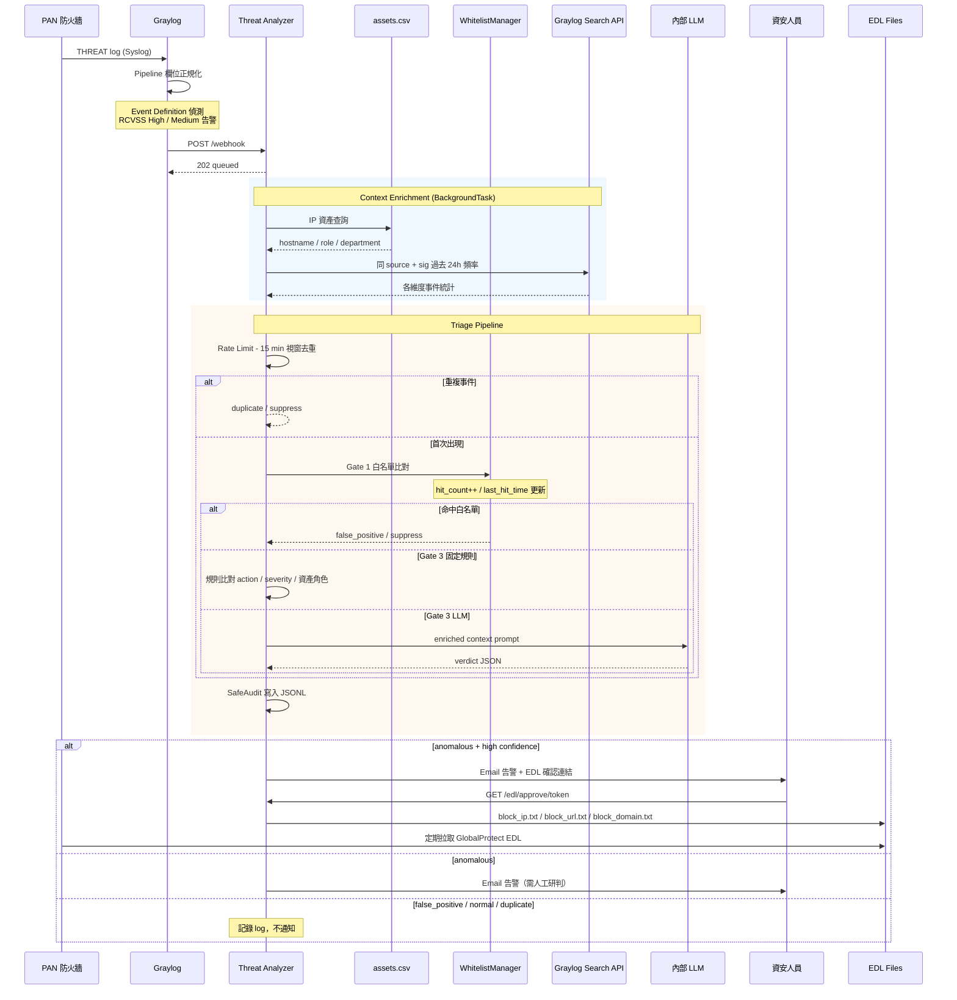

# Graylog Threat Analyzer

接收 Palo Alto Networks 防火牆 THREAT log（透過 Graylog HTTP Notification），進行 Context Enrichment 與 LLM 研判，自動將事件分類為異常 / 誤判 / 正常，並依風險等級採取對應行動。

---

## 功能特色

- **多層次研判流水線**：Rate Limit 去重 → 白名單快速過濾 → 固定規則 → LLM 語意研判，逐層遞進
- **Context Enrichment**：資產清冊查詢（IP → 主機角色/部門）、Graylog 歷史頻率分析
- **動態白名單（WhitelistManager）**：`known_fp.csv` 資料驅動，per-rule TTL 滑動視窗（`-1` = 永不過期），自動追蹤 `hit_count` / `last_hit_time`，支援 hot-reload（`POST /whitelist/reload`）
- **EDL 封鎖管理**：高置信度異常自動產生封鎖建議；Email 含一鍵確認連結；EDL 檔案符合 **GlobalProtect 規範**（IP / URL / Domain 三檔分離），per-entry TTL 滑動視窗
- **稽核追蹤（SafeAudit）**：每個研判結果寫入每日 JSONL，`GET /audit/export?format=csv` 可下載分析師用 CSV
- **共用 TTL 機制（ExpiryPolicy）**：EDL 與 Whitelist 共用同一套 TTL dataclass，sliding window + `-1` 永不過期
- **HTML 告警 Email**：結構化呈現 verdict、enriched context、頻率統計，支援多位收件人

---

## 系統流程



---

## 研判流程

事件依下列優先順序逐層研判，命中第一層即回傳結果：

| 層級 | 機制 | 觸發條件 | 結果 | stage |
|------|------|----------|------|-------|
| **RL** | **Rate Limit** | 同 src_ip + sig_id 在 15 分鐘視窗內重複出現 | `duplicate` / suppress | `rate_limit` |
| **G1** | **白名單（known_fp.csv）** | 符合 signature + action + IP 規則（支援 CIDR） | `false_positive` / suppress | `whitelist` |
| G3-1 | **固定規則：PA 已阻擋** | action = drop/block-ip/reset-both，外部 IP | `false_positive` | `gate3_rule` |
| G3-2 | **固定規則：informational alert** | severity = informational，action = alert | `normal` | `gate3_rule` |
| G3-3 | **固定規則：已知端點 → AD** | src = user-endpoint，dst = domain-controller，NTLMSSP | `normal` | `gate3_rule` |
| G3-4 | **固定規則：未知外部 IP** | src 不在資產清冊且非 RFC1918 | `anomalous` / high / block | `gate3_rule` |
| G3-5 | **固定規則：未知內部 IP** | src 不在資產清冊但為 RFC1918 | `anomalous` / medium | `gate3_rule` |
| G3-6 | **固定規則：多 Signature 掃描** | 同 src 過去 24h 觸發 > 5 種 signature | `anomalous` / medium | `gate3_rule` |
| G3-L | **LLM 研判** | 未命中以上規則，且已設定 LLM endpoint | LLM 回傳 verdict JSON | `gate3_llm` |
| — | **預設** | 所有規則皆未命中 | `anomalous` / low / monitor | `gate3_rule` |

---

## 目錄結構

```
graylog-threat-analyzer/
├── src/
│   ├── webhook_server.py      # FastAPI 主入口；/webhook、/audit/export、/whitelist/reload
│   ├── triage_engine.py       # 研判主流程：RL → Gate1 → Gate3
│   ├── enrichment.py          # Context enrichment（資產、頻率）
│   ├── graylog_client.py      # Graylog Search API 封裝
│   ├── llm_client.py          # LLM 研判（Gate 3）+ TriageVerdict model
│   ├── whitelist_manager.py   # 動態白名單（Gate 1）：TTL sweep、hit tracking、hot-reload
│   ├── expiry_policy.py       # 共用 TTL dataclass（sliding window，-1 = 永不過期）
│   ├── safe_audit.py          # 每日 JSONL 稽核寫入 + CSV 匯出
│   ├── rate_limiter.py        # 15 分鐘視窗去重
│   ├── notifier.py            # HTML Email 通知
│   └── edl_manager.py         # EDL 管理（GlobalProtect 格式、pending queue、TTL）
├── config/
│   ├── config.example.yaml    # 設定範本
│   ├── assets.csv             # IP 資產清冊（IP → hostname/role/department）
│   └── known_fp.csv           # 已知誤判白名單規則
├── data/
│   └── audit/                 # 每日 JSONL 稽核（YYYY-MM-DD.jsonl，自動建立）
├── prompts/
│   └── triage.md              # LLM prompt template
├── tests/
│   └── test_webhook.py        # pytest 測試（47 cases）
├── scripts/
│   └── preview_email.py       # Email 樣式預覽工具
├── Dockerfile
└── requirements.txt
```

---

## 快速開始

```bash
# 1. 安裝依賴
pip install -r requirements.txt

# 2. 複製並編輯設定
cp config/config.example.yaml config/config.yaml
# 填入 Graylog API、LLM endpoint、SMTP、EDL 路徑

# 3. 啟動服務
uvicorn src.webhook_server:app --host 0.0.0.0 --port 8000

# 或使用 Docker
docker build -t graylog-threat-analyzer .
docker run -p 8000:8000 \
  -v $(pwd)/config:/app/config \
  -v $(pwd)/data:/app/data \
  graylog-threat-analyzer

# 4. 確認服務正常
curl http://localhost:8000/health
```

---

## 設定說明

詳見 `config/config.example.yaml`，主要區塊：

| 區塊 | 重要欄位 | 說明 |
|------|----------|------|
| `server` | `webhook_token` | Graylog webhook 驗證 token（建議設定） |
| `graylog` | `api_url`, `api_token` | 用於 enrichment 查詢歷史頻率 |
| `llm` | `api_url`, `model`, `api_key` | OpenAI-compatible chat completions endpoint |
| `smtp` | `host`, `port`, `recipients` | 支援多位收件人（YAML list） |
| `edl` | `output_dir`, `default_ttl_days` | PA/GlobalProtect 可透過 HTTP 拉取此目錄的封鎖清單 |
| `assets` | `csv_path` | IP 資產清冊 CSV |
| `whitelist` | `csv_path`, `default_ttl_days`, `sweep_interval_seconds` | 已知誤判白名單；TTL 預設 90 天；`-1` = 永不過期 |
| `rate_limit` | `window_seconds`, `maxsize` | 去重視窗（預設 15 分鐘） |
| `audit` | `output_dir` | 稽核 JSONL 輸出目錄（預設 `data/audit/`） |

### 多位收件人設定範例

```yaml
smtp:
  recipients:
    - "analyst1@example.com"
    - "analyst2@example.com"
```

---

## Graylog 設定建議

### Event Definition

在 Graylog Event Definition 的「Fields」頁籤加入以下欄位萃取，讓研判更精準：

| Event Field Name | Graylog Stream 欄位 | 說明 |
|---|---|---|
| `Severity` | `vendor_alert_severity` | 啟用 informational 判斷規則 |
| `SignatureName` | `alert_signature` | 完整 `"Name(ID)"` 格式 |
| `SourceZone` | `source_zone` | |
| `DestinationZone` | `destination_zone` | |
| `RuleName` | `rule_name` | |
| `Protocol` | `network_transport` | |
| `Direction` | `pan_alert_direction` | |

### JMTE Body Template（Custom HTTP Notification）

```json
{
  "event_definition_id": "${event_definition_id}",
  "event_title":         "${event_definition_title}",
  "event_id":            "${event.id}",
  "event_timestamp":     "${event.timestamp}",
  "event_priority":      ${event.priority},
  "fields": {
    "source_address":    "${event.fields.source_ip}",
    "destination_address":"${event.fields.destination_ip}",
    "source_user":       "${event.fields.source_user_name}",
    "destination_user":  "${event.fields.destination_user_name}",
    "action":            "${event.fields.vendor_event_action}",
    "threat_id":         "${event.fields.alert_signature}",
    "rcvss":             "${event.fields.RCVSS}",
    "firewall":          "${event.fields.gl2_remote_ip}",
    "severity":          "${event.fields.Severity}",
    "signature_name":    "${event.fields.SignatureName}",
    "source_zone":       "${event.fields.SourceZone}",
    "destination_zone":  "${event.fields.DestinationZone}",
    "rule_name":         "${event.fields.RuleName}",
    "transport":         "${event.fields.Protocol}",
    "direction":         "${event.fields.Direction}"
  },
  "backlog": []
}
```

Webhook URL：`http://YOUR_ANALYZER_IP:8000/webhook`
Header：`X-Webhook-Token: <webhook_token>`

---

## 白名單規則維護（known_fp.csv）

### CSV 欄位說明

```
signature_id, signature_name, action, source_ip, destination_ip,
note, status, ttl_days, last_hit_time, hit_count
```

| 欄位 | 說明 |
|------|------|
| `signature_id` | Signature 數字 ID（如 `92322`） |
| `signature_name` | Signature 全名（比對時取 ID 部分） |
| `action` | 逗號分隔的 action；留空 = 任意 |
| `source_ip` / `destination_ip` | 支援單一 IP、CIDR、逗號分隔；留空 = 任意 |
| `note` | 備註說明（出現在告警 log） |
| `status` | `confirmed`（穩定）/ `testing`（觀察中） |
| `ttl_days` | TTL 天數；空白 = 使用 config 預設值；`-1` = **永不過期** |
| `last_hit_time` | 最後命中時間（程式自動維護，ISO 8601） |
| `hit_count` | 累計命中次數（程式自動維護） |

### 範例規則

```csv
# CIDR 網段
92322,Microsoft Windows NTLMSSP Detection,alert,,192.168.2.0/24,AD 伺服器網段,confirmed,,, 0
# 精確 IP（多個以逗號分隔，需引號包覆）
92322,Microsoft Windows NTLMSSP Detection,alert,,"192.168.2.7,192.168.2.8",AD DC,confirmed,,,0
# 永不過期規則
36540,PSEXEC SMB V2 Remote Execution Found,alert,10.0.4.100,,IT 人員操作,confirmed,-1,,0
```

### 修改後生效

```bash
# 直接編輯 CSV 後呼叫 hot-reload（無需重啟服務）
curl -X POST http://localhost:8000/whitelist/reload
```

---

## EDL 管理

### GlobalProtect EDL 格式

服務產生三個純文字檔供 PAN 防火牆拉取：

| 檔案 | 內容 |
|------|------|
| `block_ip.txt` | IP 位址與 CIDR 網段 |
| `block_url.txt` | HTTP/HTTPS URL 與萬用字元（`*.evil.cn`） |
| `block_domain.txt` | 網域名稱 |

每個檔案含標準 GlobalProtect header：
```
# Generated by Graylog Threat Analyzer
# Updated: 2026-04-25T10:00:00Z
# Count: 5
```

### 修改 per-entry TTL

```bash
# 設定某 IP 永不過期（ttl_days = -1）
curl -X PATCH http://localhost:8000/edl/entry/192.168.1.100 \
  -H "Content-Type: application/json" \
  -d '{"ttl_days": -1}'
```

---

## 稽核匯出

每個研判結果（包含 duplicate / false_positive / normal / anomalous）都會寫入當日 JSONL：

```bash
# 下載今日稽核 CSV
curl "http://localhost:8000/audit/export?format=csv" -o audit_today.csv

# 下載指定日期 JSONL
curl "http://localhost:8000/audit/export?date=2026-04-24&format=jsonl"
```

CSV 欄位：`timestamp, stage, verdict, confidence, reasoning, recommended_action, src_ip, dst_ip, signature_id, signature_name`

---

## 測試

```bash
pytest tests/ -v
```

目前涵蓋 **47 個測試案例**：

| 測試類別 | 案例數 | 涵蓋範圍 |
|---------|--------|----------|
| `TestEnrichment` | 2 | 工具函式 |
| `TestExpiryPolicy` | 4 | TTL permanent / expired / not-expired / never-hit |
| `TestEDLEntry` | 7 | 建立、序列化、過期、分類、sliding window、TTL 更新 |
| `TestRuleBasedTriage` | 5 | Gate 3 固定規則（6 條） |
| `TestEDLApproval` | 5 | pending queue 生命週期 |
| `TestWhitelistManager` | 11 | 命中、CIDR、hit tracking、sweep、write_back、triage 整合 |
| `TestWhitelistManagerCIDR` | 4 | CIDR 邊界、混合 IP+CIDR |
| `TestRateLimiter` | 5 | 去重邏輯、triage 整合 |
| `TestSafeAudit` | 4 | JSONL 寫入、欄位驗證、CSV 匯出 |

---

## API 端點

| Method | Path | 說明 |
|--------|------|------|
| `POST` | `/webhook` | Graylog HTTP Notification 接收端點 |
| `POST` | `/webhook/graylog` | 同上（別名） |
| `GET` | `/edl/approve/{token}` | 確認 EDL 封鎖條目 |
| `GET` | `/edl/reject/{token}` | 拒絕 EDL 封鎖條目 |
| `GET` | `/edl/pending` | 列出待審 EDL 條目 |
| `PATCH` | `/edl/entry/{value}` | 修改 per-entry TTL（`{"ttl_days": -1}` = 永不過期） |
| `POST` | `/whitelist/reload` | 熱重載白名單 CSV |
| `GET` | `/audit/export` | 匯出稽核紀錄（`?date=YYYY-MM-DD&format=jsonl\|csv`） |
| `GET` | `/health` | 服務健康檢查 |

---

## 開發路線

| 階段 | 狀態 | 內容 |
|------|------|------|
| Phase 1 | ✅ 完成 | Webhook 接收、enrichment、BackgroundTask、固定規則研判、Email 通知、Rate Limiter |
| Phase 2 | ✅ 完成 | WhitelistManager（TTL/hit tracking/hot-reload）、SafeAudit JSONL、EDL GlobalProtect 格式、ExpiryPolicy |
| Phase 3 | 🔲 規劃中 | Gate 2 可插拔黑名單（AbuseIPDB / FireHOL / custom）；自動封鎖黑名單命中 IP |
| Phase 4 | 🔲 規劃中 | `/learn/false_positive` AI 規則生成；`testing` → `confirmed` 升級流程 |
